# Caso #1: Batalla de Mutantes

Juego automático de batalla entre dos equipos de mutantes, desarrollado en Java para el curso de Programación Orientada a Objetos.

El usuario solo indica **cuántos mutantes tendrá cada equipo** (de 3 a 11). A partir de ahí el programa crea los mutantes al azar, los pone a moverse por el campo de batalla y deja que se enfrenten solos, en tiempo real, hasta que uno de los dos equipos se queda sin mutantes vivos. Al terminar se puede iniciar una partida nueva.

## Cómo ejecutarlo

- **Juego completo:** ejecutar `programaMutante.Main`, escribir el tamaño de los equipos y presionar **Iniciar**.
- **Pruebas por capa:** cada capa tiene su propio programa de prueba (ver [Programas de prueba](#programas-de-prueba)).

## Reglas de la batalla

- Cada mutante empieza con **100 de energía**, una **defensa** al azar entre 1 y 3 y **un poder** con un **daño** inicial al azar entre 1 y 3.
- Los mutantes se mueven solos por el campo: caminan en línea recta unos pasos, cambian de dirección al azar y **rebotan** en los bordes.
- Cuando un mutante entra en el **radio de combate** de un enemigo, cada uno decide si **ataca** o **defiende**:

| Mutante A | Mutante B | Resultado |
|---|---|---|
| ataca | ataca | ambos pierden el daño completo del otro |
| ataca | defiende | B pierde el daño de A dividido entre la defensa de B |
| defiende | ataca | A pierde el daño de B dividido entre la defensa de A |
| defiende | defiende | no pasa nada |

- Quien logra bajarle energía al enemigo **aumenta el daño de su poder en 1**, hasta un máximo de **7**.
- Después de un combate, ambos mutantes esperan un momento corto (**enfriamiento**) antes de poder pelear otra vez.
- La **profesión** influye en la batalla: cada una tiene su propia probabilidad de atacar (el Pirata es el más agresivo y el Músico el más defensivo).
- Gana el equipo que conserve mutantes vivos. Si los últimos de ambos equipos caen al mismo tiempo, es **empate**.

## Arquitectura: capas y paquetes

El programa está dividido en cuatro capas. Cada capa es uno o más paquetes y solo conoce a las capas de abajo.

Además, el paquete `constantes` guarda todos los valores fijos del programa y `programaMutante` contiene el programa principal.

### Modelo: `personas`, `profesiones`, `poderes`

Representa a los mutantes y sus poderes.

- **`Persona`**: clase base de todos los mutantes. Guarda su identificador único, energía, defensa, posición, velocidad y su poder. Sabe recibir daño, calcular la distancia a otro mutante, decidir si ataca y controlar su tiempo de enfriamiento. Lleva un contador `static` compartido con la cantidad de personas creadas.
- **`Futbolista`, `Musico` y `Pirata`**: heredan de `Persona`, agregan acciones propias de su profesión y sobrescriben `getProbabilidadAtaque()`, para que cada profesión pelee con un estilo distinto (**polimorfismo**).
- **`IPower`**: interfaz que define lo que todo poder debe saber hacer: `dispararPoder()`, `getDanio()` y `aumentarDanio()`. `Persona` solo conoce esta interfaz.
- **`PoderMutante`**: clase abstracta que implementa `IPower` y guarda el daño del poder. Existe porque una interfaz no puede guardar atributos de objeto.
- **`PoderTirarAster`, `PoderTirarCelebs`, `PoderTirarEstrellas`, `PoderTirarFlechas`, `PoderTirarPrimos`**: los cinco poderes concretos. Cada uno solo define cómo se ve al dispararse.

### Juego: `juego`

Organiza la batalla, sin dibujar nada y sin mover a nadie.

- **`Campo`**: guarda el ancho y el alto del campo de batalla.
- **`Equipo`**: nombre, color, símbolo y sus mutantes. Cuenta cuántos siguen vivos y cuántos murieron.
- **`Partida`**: crea el campo y los dos equipos con la misma cantidad de mutantes, cada uno con una profesión y un poder al azar (cada mutante recibe su **propia** instancia de poder). Indica los enemigos de cada mutante, si la partida terminó, si hubo empate y quién ganó.

### Control: `control`

Hace que la batalla ocurra. Aquí vive el esquema de **hilos**.

- **`HiloMutante`**: un hilo por mutante. En un ciclo mueve a su mutante, revisa si hay enemigos dentro del radio y, si los hay, inicia el combate. Se detiene cuando su mutante muere o la partida termina.
- **`Combate`**: resuelve el encuentro entre dos mutantes según las reglas de arriba. Su método `resolver` es `static synchronized`, así que solo se resuelve un combate a la vez y dos hilos nunca modifican la misma energía al mismo tiempo.
- **`MotorBatalla`**: arranca un `HiloMutante` por cada mutante y, mientras la partida sigue, avisa a sus observadores a una frecuencia configurable.
- **`IObservador`**: interfaz del patrón **Observer**, con el método `actualizar()`.
- **`ObservadorConsola`**: observador que imprime el marcador en consola cada vez que cambia. Se usa para probar la capa sin ventana.

**Una sola acción por pareja:** cuando dos enemigos se detectan al mismo tiempo, solo el hilo del mutante con menor identificador resuelve el combate.

### UI: `ui`

La parte visual. Sigue el patrón **MVC** junto con **Observer**, y nunca implementa lógica del juego: solo consulta a las otras capas.

- **Modelo:** `Partida`, `Equipo` y `Persona`.
- **Vista:** `VentanaJuego` (la ventana con el campo de texto, el botón y los mensajes) y `PanelCampo` (dibuja a los mutantes vivos con el color y símbolo de su equipo, su barra de energía, el marcador de vivos y muertos por equipo y el ganador). `PanelCampo` implementa `IObservador`: cada vez que el motor avisa, se vuelve a dibujar.
- **Controlador:** `ControladorUI` recibe el clic en **Iniciar**, valida el tamaño escrito, detiene la partida anterior si existe, crea la nueva `Partida` y el `MotorBatalla`, y registra el panel como observador.

### Constantes: `constantes`

**`Constantes`** contiene todos los valores fijos: energía inicial, rangos de defensa y daño, tamaños de equipo, medidas del campo, radio de combate, velocidades, tiempos de los hilos, colores y textos de la interfaz. Para cambiar el comportamiento del juego se pueden editar los distintos valores de este archivo según convenga.

### Programa principal: `programaMutante`

**`Main`** crea la ventana y el controlador y muestra la ventana. Desde ese momento todo avanza por los clics del usuario y por los hilos.

## Programas de prueba

Cada capa tiene un programa con `main` para probarla por separado:

| Programa | Qué prueba |
|---|---|
| `personas.PruebaModelo` | profesiones, poderes, energía, daño, distancia y decisiones de ataque |
| `juego.PruebaJuego` | creación de la partida y los equipos, marcador y detección del ganador |
| `control.PruebaControl` | una batalla completa con hilos, mostrada en consola |
| `ui.PruebaUI` | el dibujo de una partida sin movimiento |

## Diagrama de clases

```plantuml
@startuml
skinparam classAttributeIconSize 0
skinparam packageStyle rectangle
left to right direction

package "constantes" {
    class Constantes <<final>> {
        + {static} ENERGIA_INICIAL: double
        + {static} DANIO_MAXIMO: int
        + {static} RADIO_COMBATE: double
        + {static} REFRESCO_UI_MS: int
        .. y demás constantes ..
    }
}

package "personas" {
    class Persona {
        - byte edad
        # String nombre
        - IPower power
        - {static} int cantidadPersonas
        - int id
        - double energia
        - int defensa
        - double x
        - double y
        - double velocidad
        - long finEnfriamiento
        + setPower(IPower): void
        + getPower(): IPower
        + atacar(): void
        + setPosicion(double, double): void
        + tienePoder(): boolean
        + estaVivo(): boolean
        + recibirDanio(double): void
        + distanciaA(Persona): double
        + getProbabilidadAtaque(): double
        + decidirAtacar(): boolean
        + puedeCombatir(): boolean
        + iniciarEnfriamiento(): void
        + {static} getCantidadPersonas(): int
    }
    class PruebaModelo {
        + {static} main(String[]): void
    }
}

package "profesiones" {
    class Futbolista {
        - String equipo
        - int netWorth
        - int salario
        + cambiarEquipo(String): void
        + pagarFutbolista(): void
        + getProbabilidadAtaque(): double
    }
    class Musico {
        - String generoMusical
        - String[] cancionesCompuestas
        - int cantidadCanciones
        + componerCancion(String): void
        + nombrarCancionesCompuestas(): void
        + cantar(): void
        + getProbabilidadAtaque(): double
    }
    class Pirata {
        - String nombreBarco
        - int tesorosEncontrados
        - boolean tieneLoro
        - String nombreLoro
        + buscarTesoro(): void
        + gritar(): void
        + getProbabilidadAtaque(): double
    }
}

package "poderes" {
    interface IPower {
        + dispararPoder(): void
        + getDanio(): int
        + aumentarDanio(): void
    }
    abstract class PoderMutante {
        - int danio
        + getDanio(): int
        + aumentarDanio(): void
        + {abstract} dispararPoder(): void
    }
    class PoderTirarAster
    class PoderTirarCelebs
    class PoderTirarEstrellas
    class PoderTirarFlechas
    class PoderTirarPrimos
}

package "juego" {
    class Campo {
        - int ancho
        - int alto
        + estaDentro(double, double): boolean
    }
    class Equipo {
        - String nombre
        - Color color
        - String simbolo
        - Persona[] mutantes
        - int cantidad
        + agregarMutante(Persona): void
        + contiene(Persona): boolean
        + contarVivos(): int
        + contarMuertos(): int
        + tieneVivos(): boolean
    }
    class Partida {
        - Campo campo
        - Equipo equipo1
        - Equipo equipo2
        - int tamanioEquipo
        + {static} esTamanioValido(int): boolean
        - crearEquipos(): void
        - crearMutanteAleatorio(): Persona
        - crearPoderAleatorio(): IPower
        - colocarMutante(Persona, boolean): void
        + getEquipoDe(Persona): Equipo
        + getEnemigosDe(Persona): Persona[]
        + estaTerminada(): boolean
        + esEmpate(): boolean
        + getGanador(): Equipo
    }
    class PruebaJuego {
        + {static} main(String[]): void
    }
}

package "control" {
    interface IObservador {
        + actualizar(): void
    }
    class Combate {
        + {static} resolver(Persona, Persona): void
        - {static} aplicarAtaque(Persona, Persona, boolean): void
        - {static} calcularDanio(Persona, Persona, boolean): double
    }
    class HiloMutante {
        - Persona mutante
        - Partida partida
        - double direccionX
        - double direccionY
        - int pasosRestantes
        - boolean activo
        + run(): void
        - mover(): void
        - cambiarDireccion(): void
        - buscarEnemigos(): void
        + detener(): void
    }
    class MotorBatalla {
        - Partida partida
        - HiloMutante[] hilos
        - ArrayList<IObservador> observadores
        - boolean activo
        + agregarObservador(IObservador): void
        - notificarObservadores(): void
        - iniciarHilos(): void
        + run(): void
        + detener(): void
    }
    class ObservadorConsola {
        - Partida partida
        - int ultimosVivos1
        - int ultimosVivos2
        + actualizar(): void
    }
    class PruebaControl {
        + {static} main(String[]): void
    }
}

package "ui" {
    class VentanaJuego {
        - PanelCampo panelCampo
        - JTextField campoTamanio
        - JButton botonIniciar
        - JLabel etiquetaMensaje
        + getTextoTamanio(): String
        + mostrarMensaje(String): void
    }
    class PanelCampo {
        - Partida partida
        + setPartida(Partida): void
        + actualizar(): void
        # paintComponent(Graphics): void
    }
    class ControladorUI {
        - VentanaJuego vista
        - Partida partida
        - MotorBatalla motor
        + actionPerformed(ActionEvent): void
        - iniciarPartida(): void
    }
    class PruebaUI {
        + {static} main(String[]): void
    }
}

package "programaMutante" {
    class Main {
        + {static} main(String[]): void
    }
}

' ---------- Herencia e implementación ----------
Persona <|-- Futbolista
Persona <|-- Musico
Persona <|-- Pirata
IPower <|.. PoderMutante
PoderMutante <|-- PoderTirarAster
PoderMutante <|-- PoderTirarCelebs
PoderMutante <|-- PoderTirarEstrellas
PoderMutante <|-- PoderTirarFlechas
PoderMutante <|-- PoderTirarPrimos
Thread <|-- HiloMutante
Thread <|-- MotorBatalla
IObservador <|.. PanelCampo
IObservador <|.. ObservadorConsola
JFrame <|-- VentanaJuego
JPanel <|-- PanelCampo
ActionListener <|.. ControladorUI

' ---------- Asociaciones ----------
Persona --> "0..1" IPower : tiene
Partida *-- "1" Campo
Partida *-- "2" Equipo
Equipo o-- "3..11" Persona
HiloMutante --> Persona : mueve
HiloMutante --> Partida : consulta
HiloMutante ..> Combate : usa
MotorBatalla --> Partida
MotorBatalla *-- HiloMutante
MotorBatalla --> IObservador : notifica
ObservadorConsola --> Partida : consulta
VentanaJuego *-- PanelCampo
PanelCampo --> Partida : consulta
ControladorUI --> VentanaJuego
ControladorUI --> Partida : crea
ControladorUI --> MotorBatalla : crea
Main ..> VentanaJuego : crea
Main ..> ControladorUI : crea
@enduml
```

Ver código PlantUML

