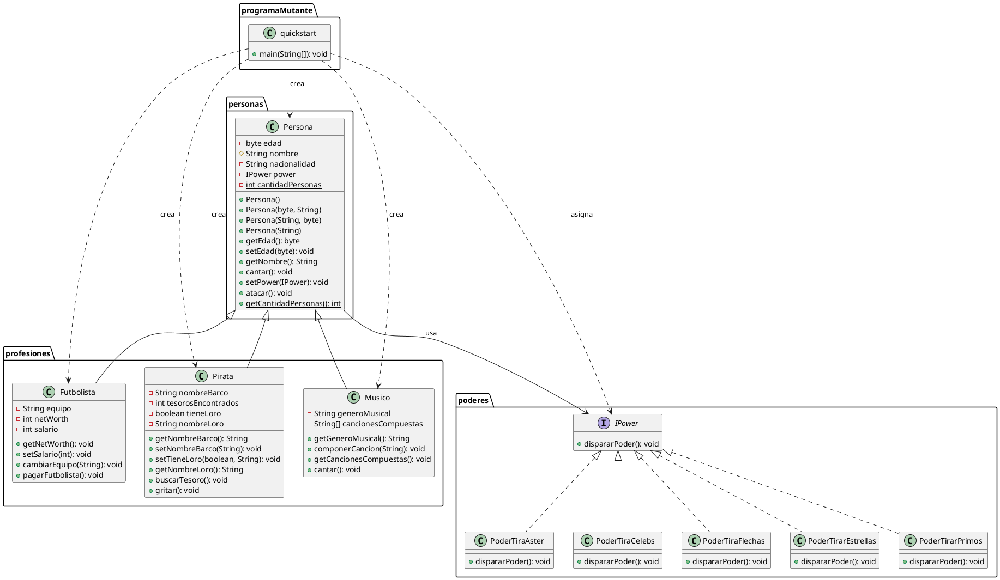

# Caso #1 - Batalla de Mutantes

## ¿Qué hace el programa? (Entrega Semana 5)

Este programa crea 10 personas de forma aleatoria. Cada persona recibe automáticamente una profesión al azar entre 3 posibles (**futbolista**, **músico** o **pirata**), y también un poder al azar entre 5 disponibles. Una vez que todas las personas están creadas, el programa hace que cada una ataque usando el poder que le tocó.

La idea detrás de esto es demostrar:
- Que cada profesión, aunque todas vienen de la misma clase base `Persona`, se comporta distinto (por ejemplo, un `Pirata` puede buscar tesoros y un `Futbolista` puede cambiar de equipo, cosas que una `Persona` normal no puede hacer).
- Que sin importar qué profesión tenga una persona, el poder que le tocó siempre funciona y se muestra el efecto en consola.

## Descripción de las clases

### Paquete `personas`

**`Persona`** es la clase base de la que heredan todas las profesiones. Guarda el nombre, la edad, la nacionalidad, y el poder (`IPower`) que tenga asignado. También lleva un contador `static` que cuenta cuántas personas se han creado en total, sin importar la profesión, ya que ese contador es compartido por todas.

### Paquete `profesiones`

Estas 3 clases heredan de `Persona` y le agregan su propio comportamiento:

- **`Futbolista`**: tiene un equipo, un salario y un patrimonio (`netWorth`). Puede cambiarse de equipo, y su patrimonio aumenta cuando se le paga el salario.
- **`Musico`**: tiene un género musical y una lista de canciones que ha compuesto (hasta 5). Puede componer canciones nuevas y mostrar la lista de las que ya tiene.
- **`Pirata`**: tiene un barco, puede tener o no un loro, y lleva la cuenta de cuántos tesoros ha encontrado. Puede salir a buscar tesoros y gritar.

### Paquete `poderes`

**`IPower`** es una interfaz: define que todo poder debe tener un método `dispararPoder()`, pero no dice cómo. Cada clase que la implementa decide como se ve:

- **`PoderTirarAster`**
- **`PoderTirarCelebs`**
- **`PoderTirarFlechas`**
- **`PoderTirarEstrellas`**
- **`PoderTirarPrimos`**

Ninguna de estas clases sabe nada sobre las profesiones — cualquier `Persona`, sin importar cuál profesión tenga, puede tener asignado cualquiera de estos 5 poderes.

### Paquete `programaMutante`

**`quickstart`** contiene el método `main`. Es el punto de partida del programa, es en donde se crean las 10 personas al azar, les asigna profesión y poder, y hace que todas ataquen.

# Spec completo para el programa

## Modelo (paquetes personas, profesiones y poderes)

Extiende lo de la semana 5.

- **Persona**: clase base. Se le agregan `id` (único), `energia` (inicia en 100), `defensa` (entre 1 y 3), posición (`x`, `y`) y `velocidad`. También `estaVivo()`, `recibirDanio()`, `distanciaA()` y `decidirAtacar()`.
- **Futbolista, Musico y Pirata**: heredan de Persona.
- **IPower**: interfaz de los poderes. Persona solo conoce esta interfaz.
- **PoderMutante**: clase abstracta que implementa IPower y guarda el daño del poder (empieza entre 1 y 3 y llega máximo a 7).
- **Los 5 poderes**: heredan de PoderMutante y solo implementan `dispararPoder()`.

Importante: cada mutante recibe su propia instancia de poder, porque el daño de cada uno crece por separado.

## Juego (paquete juego)

- **Campo**: guarda el ancho y el alto del campo de batalla.
- **Equipo**: guarda su color, su símbolo y sus mutantes. Calcula cuántos siguen vivos.
- **Partida**: crea los dos equipos con la misma cantidad de mutantes al azar. Sabe si terminó y quién ganó. Si los últimos mutantes de ambos equipos mueren a la vez, es empate.

## Control (paquete control)

- **HiloMutante**: un hilo por mutante. Lo mueve por el campo y revisa si hay enemigos dentro del radio. Se detiene cuando el mutante muere o la partida termina.
- **Combate**: resuelve el combate entre dos mutantes.
- **MotorBatalla**: crea y arranca los hilos de la partida y avisa a la UI cuando algo cambia.
- **IObservador**: interfaz con `actualizar()`, la usa la UI para enterarse de los cambios.

Sobre el movimiento: cada mutante mantiene una dirección durante unos pasos y luego elige otra al azar. Si llega a un borde del campo, rebota.

Distintos escenarios de batalla: cuando dos enemigos entran en el radio, cada uno decide al azar si ataca o defiende. Si uno ataca y el otro defiende, el que defiende pierde el daño dividido entre su defensa. Si el otro no defiende, pierde el daño completo. Si ambos atacan, ambos pierden el daño completo. Si ambos defienden, no pasa nada. Quien logra bajar energía sube el daño de su poder en 1 (máximo 7). La energía es `double` para que la división no pierda decimales.

Nota sobre los hilos: cuando dos mutantes se detectan a la vez, solo el de menor `id` resuelve el combate, para que sea una sola acción por pareja. El método que resuelve el combate es `synchronized` para que dos hilos no modifiquen la energía al mismo tiempo. El movimiento sí es completamente paralelo.

## UI (paquete ui)

Usa MVC y Observer. La UI solo dibuja lo que pasa en las otras capas y nunca decide nada del juego.

- **Modelo**: Partida, equipos y mutantes, que la UI solo consulta.
- **Vista**: `VentanaJuego` (ventana con el tamaño de equipos y los botones) y `PanelCampo` (dibuja mutantes, equipos, energía, vivos y muertos, y el ganador). El panel implementa IObservador y se repinta a un ritmo configurable.
- **Controlador**: `ControladorUI` recibe los clics, valida el tamaño, crea la partida y permite iniciar una nueva al terminar.

## Constantes (paquete constantes)

Una clase con todos los números fijos: energía inicial, rangos de defensa y daño, daño máximo, tamaños de equipo, radio, velocidades, medidas del campo, probabilidad de atacar, refresco de la UI, entre otros.

## Pruebas

Un `main` por capa para probarla sola: `PruebaModelo`, `PruebaJuego`, `PruebaControl` y `PruebaUI`. Más el programa principal `Main` en `programaMutante`.

## Diagrama de clases para la entrega de Semana 5

Ver código PlantUML

