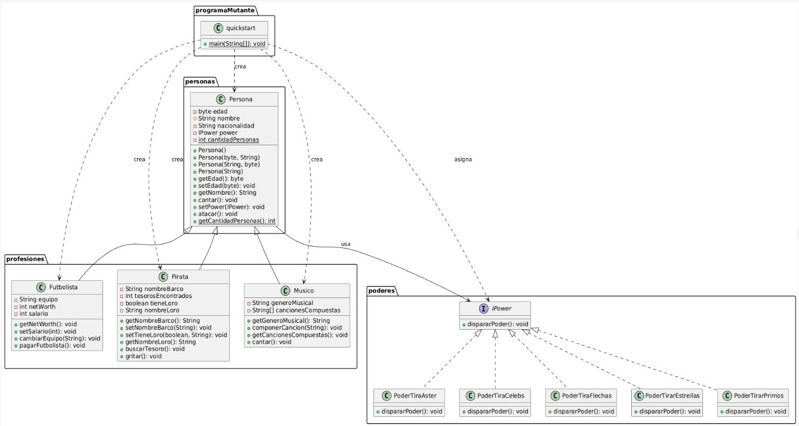
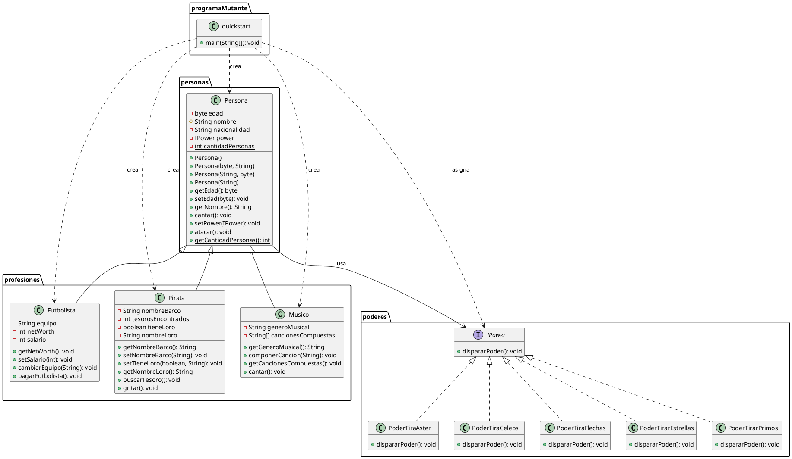

# Object Relationships — Entrega Week #5

## ¿Qué hace el programa?

Este programa crea 10 personas de forma aleatoria. Cada persona recibe automáticamente una profesión al azar entre 3 posibles (**futbolista**, **músico** o **pirata**), y también un poder al azar entre 5 disponibles. Una vez que todas las personas están creadas, el programa hace que cada una ataque usando el poder que le tocó.

La idea detrás de esto es demostrar:
- Que cada profesión, aunque todas vienen de la misma clase base `Persona`, se comporta distinto (por ejemplo, un `Pirata` puede buscar tesoros y un `Futbolista` puede cambiar de equipo, cosas que una `Persona` normal no puede hacer). Esto es **herencia**.
- Que sin importar qué profesión tenga una persona, el poder que le tocó siempre funciona igual de bien y muestra su propio efecto en consola. Esto es **polimorfismo**.

## Descripción de las clases

### Paquete `personas`

**`Persona`** es la clase base de la que heredan todas las profesiones. Guarda el nombre, la edad, la nacionalidad, y el poder (`IPower`) que tenga asignado. También lleva un contador `static` que cuenta cuántas personas se han creado en total, sin importar la profesión, ya que ese contador es compartido por todas.

### Paquete `profesiones`

Estas 3 clases heredan de `Persona` y le agregan su propio comportamiento:

- **`Futbolista`**: tiene un equipo, un salario y un patrimonio (`netWorth`). Puede cambiarse de equipo, y su patrimonio aumenta cuando se le paga el salario.
- **`Musico`**: tiene un género musical y una lista de canciones que ha compuesto (hasta 5). Puede componer canciones nuevas y mostrar la lista de las que ya tiene.
- **`Pirata`**: tiene un barco, puede tener o no un loro, y lleva la cuenta de cuántos tesoros ha encontrado. Puede salir a buscar tesoros y gritar.

### Paquete `poderes`

**`IPower`** es una interfaz: define que todo poder debe tener un método `dispararPoder()`, pero no dice cómo. Cada clase que la implementa decide como se ve:

- **`PoderTiraAster`**
- **`PoderTiraCelebs`**
- **`PoderTiraFlechas`**
- **`PoderTirarEstrellas`**
- **`PoderTirarPrimos`**

Ninguna de estas clases sabe nada sobre las profesiones — cualquier `Persona`, sin importar cuál profesión tenga, puede tener asignado cualquiera de estos 5 poderes.

### Paquete `programaMutante`

**`quickstart`** contiene el método `main`. Es el punto de partida del programa, es en donde se crean las 10 personas al azar, les asigna profesión y poder, y hace que todas ataquen.

## Diagrama de clases

Ver código PlantUML

